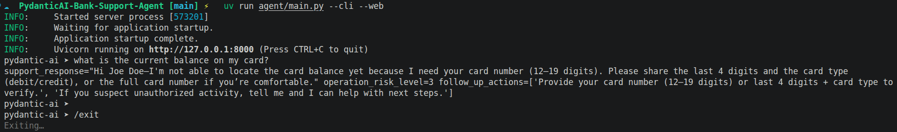
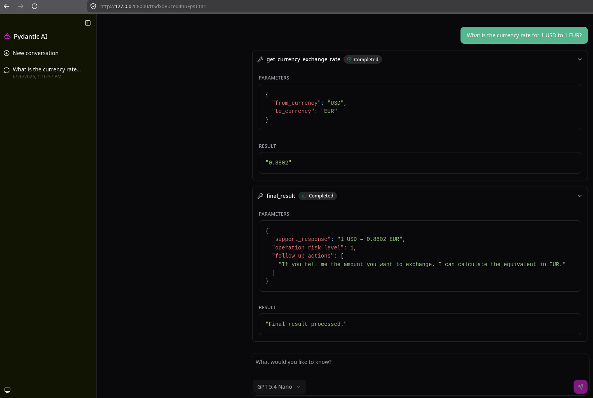

## About

A bank customer support agent built with [PydanticAI](https://ai.pydantic.dev/). The agent identifies clients by phone number, provides account and card information, handles card deactivation requests, answers currency exchange queries, and returns structured responses that include a support message, a numeric risk level, and recommended follow-up actions.

The agent can be run as an interactive CLI session or as a web-based chat UI.


<p align="center">
  
</p>

<p align="center">
  
</p>


## Motivation

This AI agent represents a fork of the [Bank Support](https://pydantic.dev/docs/ai/examples/conversational-agents/bank-support/) agent provided by Pydantic AI. The main idea of the project is to overview the fundamentals of Pydantic AI on a real world example. In this project we separate each component of the agent by its responsibility keeping the project structure clean and readable. Ultimately there is single entry point that combines all the components and completely runs the agent. 


## Features

- Client identification by phone number
- Card balance and transaction history lookup
- Card deactivation
- Currency exchange rate queries
- Structured output with risk assessment (0–10 scale)
- Dual runtime: interactive CLI and web chat UI

## Prerequisites

- Python 3.12
- [uv](https://docs.astral.sh/uv/) package manager
- API key for [OpenRouter](https://openrouter.ai/)
- API key for [ExchangeRate-API](https://www.exchangerate-api.com/)


## Project Structure

```bash
.
├── agent.yml                # Agent spec: model, system prompt, instructions
├── pyproject.toml           # Project metadata and dependencies
├── .env                     # Environment variables for the Agent
├── CLAUDE.md                # Claude Code instructions
└── agent/
    ├── main.py              # Entry point; wires agent, tools, and runtime modes
    ├── cli.py               # CLI argument definitions
    ├── tools.py             # card_toolset and currency_toolset definitions
    ├── models.py            # SQLModel ORM: Client, Card, Transaction
    ├── dependencies.py      # AgentDeps: database session + currency service + logger
    ├── instructions.py      # Dynamic instruction: injects client name at runtime
    ├── output.py            # AgentOutput: support text, risk level, follow-up actions
    ├── exceptions.py        # Domain exceptions (ClientNotFound, CardNotFound, …)
    ├── core/
    │   ├── settings.py      # Agent settings and configuration
    │   ├── tools.py         # BaseBankAgentToolset: error handling wrapper for all tools
    │   └── database/        # Async SQLAlchemy engine, session factory, model mixins
    ├── services/
    │   ├── bank_db.py       # BankDatabaseService: client/card CRUD
    │   └── currency.py      # CurrencyService: exchange rate HTTP client
    ├── tests/
    │   ├── conftest.py      # Pytest configuration (disables live LLM calls)
    │   └── test_*.py        # Unit and integration tests
    └── scripts/
        └── seed.py          # One-time database seeding script
```


## Configuration

All settings are defined in `agent/core/settings.py` and sourced from `.env`:

| Variable | Description |
|---|---|
| `OPENROUTER_API_KEY` | API key for OpenRouter (model provider) |
| `CURRENCY_API_URL` | ExchangeRate-API base URL |

The model and agent instructions are configured in `agent.yml`.


## Setup

1. **Clone and install dependencies**

   ```bash
   git clone <repo-url>
   cd PydanticAI-Bank-Support-Agent
   uv sync --all-groups
   ```

2. **Configure environment variables**

   ```bash
   cp .env.example .env
   ```

   Edit `.env`:

   ```env
   OPENROUTER_API_KEY="your-openrouter-api-key"
   CURRENCY_API_URL="v6.exchangerate-api.com"
   ```

3. **Seed the database**

   ```bash
   uv run python agent/scripts/seed.py
   ```

   This creates `bank.db` (SQLite) and populates it with sample clients, cards, and transactions.


## Running the Agent

```bash
# Interactive CLI (default)
uv run python agent/main.py

# Web chat UI at http://127.0.0.1:8000
uv run  python agent/main.py --web

# Both CLI and web simultaneously
uv run  python agent/main.py --cli --web

# Custom host/port for the web server
uv run  python agent/main.py --web --host 0.0.0.0 --port 8080
```

## Running Tests

```bash
uv run pytest agent/tests/
```

Tests run with live LLM calls disabled (`ALLOW_MODEL_REQUESTS = False`).


## Request Flow

1. `main.py` loads the agent from `agent.yml` and attaches `card_toolset` and `currency_toolset`.
2. `instructions.py` dynamically prepends the identified client's name to the system prompt each turn.
3. During a turn the agent calls tools; all calls pass through `BaseBankAgentToolset`, which converts domain exceptions to readable strings and raises `SkipToolExecution` on unexpected errors.
4. The agent returns a structured `AgentOutput` containing the support reply, a 0–10 risk score, and a list of follow-up action recommendations.


## References

- [PydanticAI Bank Support Example](https://pydantic.dev/docs/ai/examples/conversational-agents/bank-support/)
- [Agent Specs](https://pydantic.dev/docs/ai/core-concepts/agent-spec/)
- [CLI Integration](https://pydantic.dev/docs/ai/integrations/cli/)
- [Web Chat UI](https://pydantic.dev/docs/ai/guides/web/)
- [Toolsets](https://pydantic.dev/docs/ai/tools-toolsets/toolsets)
- [OpenRouter](https://pydantic.dev/docs/ai/models/openrouter/)
